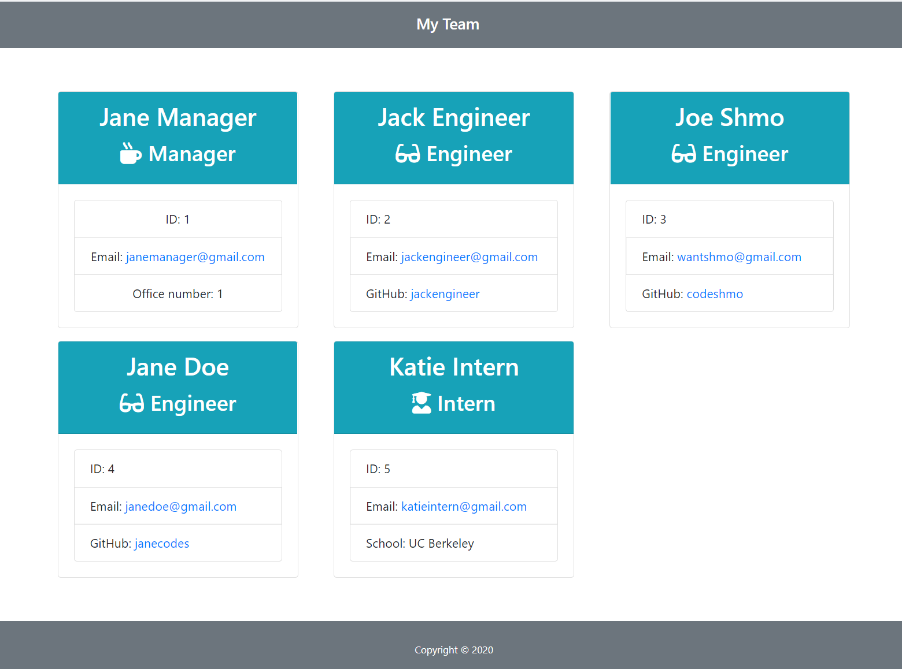

# Team Generator

## Description

This application is a software engineering team generator command line application that generates a employee team summary in an HTML file based off the user inputs. The inquirer package is utilized to obtain the user information. Once all the information is collected the application generate new classes and utilizes the built in methods to extract the required information for the HTML file. Additionally, this app has tests built with jest to ensure it is running as expected.

### Team Generator:

Start:

## Table of Contents

- [Installation](#Installation)
- [Usage](#Usage)
- [License](#License)
- [Contributing](#Contributing)
- [Tests](#Tests)
- [Questions](#Questions)

## Installation

To install this application locally clone the repository located at the Github profile in the [Questions](#Questions) section. Additionally, you will need to install the following:

1. [**node.js**](https://nodejs.org/en/)
2. [**Inquirer**](https://www.npmjs.com/package/inquirer)
3. [**npm init**](https://docs.npmjs.com/cli/v6/commands/npm-init)
4. [**jest**](https://www.npmjs.com/package/jest)

Once all of these are installed you will be able to use the application from the command line using node.js. Additionally, you will be able to test the code if you make modifications using npm run test.

## Usage

In this current release there are only 3 types of employees that can be entered (Manager, Engineer, and Intern). Each of these employees only have one unique attribute (office number, github, and school, respectively). There is currently no validation to ensure that the user input appropriate values while using inquirer (e.g., an employee id is a number) and there are no checks to ensure no duplication of employee id and office numbers.

## License

## Contributing

This Team Generator was created by [**Jason Richards**](https://github.com/jrkrichards).

## Tests

This release utilize Jest to test the application.

## Questions

Github: https://github.com/jrkrichards
